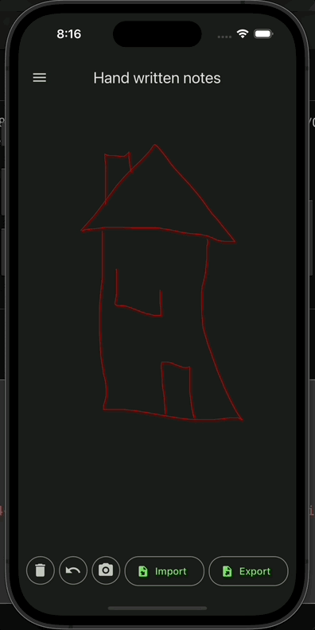
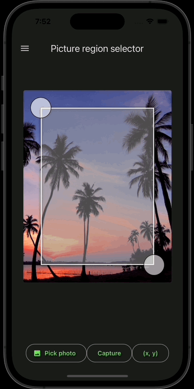
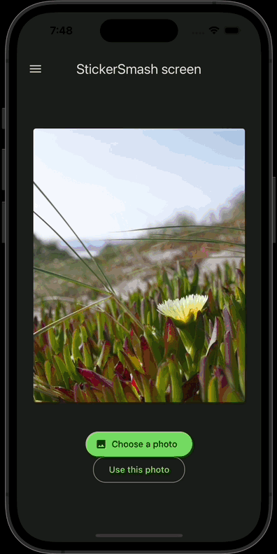

# poc-archiver

ReactNative Expo proof of concepts app


   

## This app includes the following proof of concept

- material design theme using `react-native-paper`
- encryption and decryption
- files read/write/delete/update using `Expo`
- `Expo` file sharing
- archiving and encrypting multiple files into a single file archive using `expo-sqlite`
- picture region selector using `react-native-reanimated` and `react-native-gesture-handler`
- signature pad screen using `reanimated` and `gesture-handler` and `react-native-svg`
- OAuth 2 federatedSignIn authentication using `expo-web-browser`, `aws-amplify` and `expo-linking`
  - https://docs.amplify.aws/lib/auth/social/q/platform/react-native/#full-samples
- 3D Viewer with scene and orbit controls by integrating [Three.js](https://threejs.org/) library

## Screen recordings of some POCs

Picture Zooming | Drawing surface | Picture Region Selector | Sticker Smash Screen | 3D glTF Viewer
--------------- | --------------- | ----------------------- | -------------------- | ------------------------
 |  |  |  | 

## TODOs

Some ideas about next features to explore...

### 3D Viewer
- load `Thres.js` source files directly from bundler instead of assets

### ReactNative Library
- add a full demo of a RN library


## Installation

1. Install the dependencies: 
```bash
npm install 
``` 
2. Start the application: 
```bash
npm start 
``` 
3. Run on Android or iOS device: 
```bash 
npm run android  # for Android devices 
npm run ios      # for iOS devices  
```  
4. Run on web browser:  
```bash  
npm run web      # for web browsers  
```
